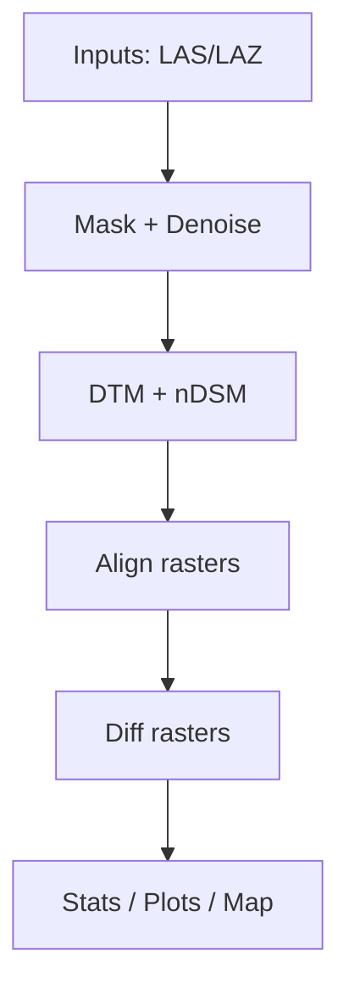

<!-- badges: start -->
[](https://github.com/cscarpon/CFCore/actions/workflows/R-CMD-check.yaml)
[](https://lifecycle.r-lib.org/articles/stages.html)
<!-- badges: end -->

**CFCore** is the core analytical engine behind *CloudFlux*.  
It provides reusable, API-friendly R functions and reference classes for **LiDAR-based change detection**, including point-cloud preprocessing, raster generation, raster alignment, and continuous change analysis.

CFCore is intentionally **UI-agnostic**. Functions and classes are designed to be called directly from R scripts, batch pipelines, reproducible research workflows, and downstream services.

---

## Architecture



## Key features

- LiDAR point-cloud preprocessing
  - Noise filtering (SOR-based)
  - 2D footprint / mask generation
- Raster derivation
  - DTM and nDSM generation
  - CRS handling and reprojection
- Two-epoch change detection
  - Raster alignment to a shared union mask
  - Continuous difference rasters (nDSM, DTM)
- Summary and reporting
  - Continuous summary statistics
  - Optional binned interpretation summaries
  - Histograms and binned plots
- Optional ICP alignment
  - Open3D-based ICP via Python (`reticulate`)
- High-level orchestration
  - `cloudFlux` reference class for end-to-end workflows

---

## Installation

### Install CFCore from GitHub

``` r
# install.packages("pak")
pak::pak("cscarpon/CFCore")
```

## installing Python environment for ICP alignment 
```
conda env create -f inst/py/conda-env.yml
conda activate icp_conda
```

## Example code and High level workflow with `cloudflux`

```r
library(CFCore)

data("TTP_15", package = "CFCore")
data("TTP_23", package = "CFCore")

cc <- cloudFlux_new(
  source_las = TTP_15,
  target_las = TTP_23,
  epsg = 26917,
  resolution = 1
)

cc$run()

# Continuous summary statistics
cc$summary_stats()

# Optional binned interpretation
breaks <- c(-10, -0.5, 0.5, 10)
cc$summary_by_breaks(breaks)

# Plots
cc$plot_hist(which = "ndsm")
cc$plot_binned(breaks, which = "ndsm")

# Interactive map (HTML contexts)
m <- cc$map(diff_breaks = breaks)
```

```r
## Workflow with unique paths:

cc <- cloudFlux_new(
  source_path = "path/to/TTP_15.laz",
  target_path = "path/to/TTP_23.laz",
  epsg = 26917
)

cc$run()
```

```r

## Using the icp-alignment workflow:

cc <- cloudFlux_new(
  source_las = TTP_15,
  target_las = TTP_23,
  epsg = 26917,
  icp_align = TRUE,
  icp_condaenv = "icp_conda",
  voxel_size = 0.05,
  icp_method = "point-to-plane"
)

cc$run()
```
